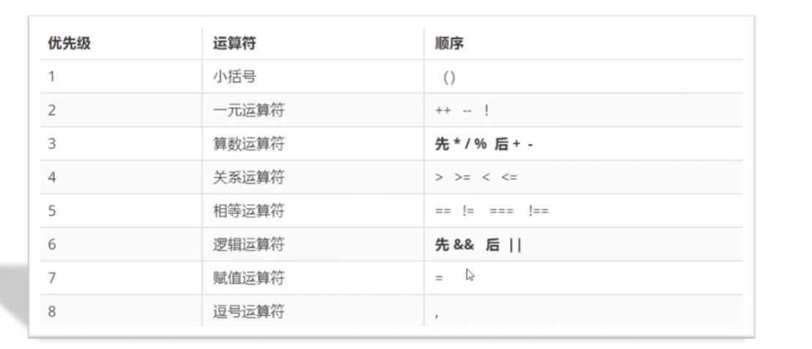
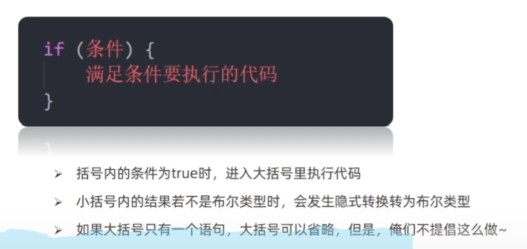
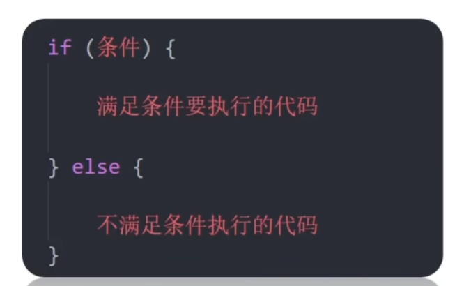
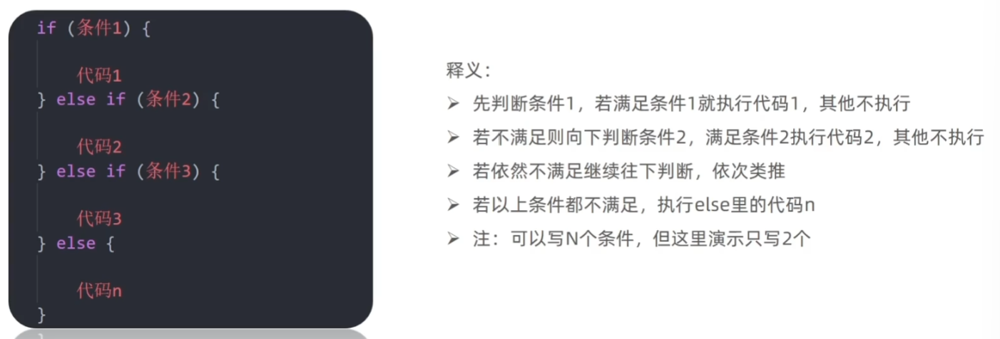
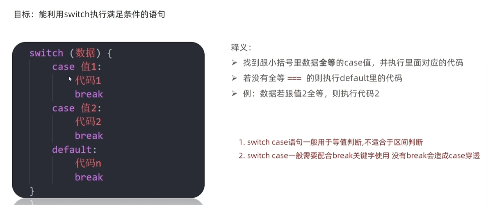

### 运算符

#### 赋值运算符

目标：能够使用赋值运算符简化代码

1. 赋值运算符：对变量进行赋值的运算符
   1. 已经学过的 = 将等号右边的值赋予给左边，要求左边必须是一个容器
   2. 其他运算符
      1. +=
         1. 
      2. -=
      3. *=
      4. /=
      5. %=
   3. 一元运算符
      1. 可以根据表达式的个数，分为一元运算符，二元运算符，三元运算符。比如说加法，需要两个操作数，所以加法就是二元运算符
      2. 一元运算符，就一个操作数，比如说正负号
      3. 自增：
         1. 符号：++
         2. 作用：让变量的值+1，只能+1
         3. 经常用于计数来使用，不如进行10次操作，用它来计算进行多少次了
         4. 前置自增：
            1. ++num  
            2. 作用相当于num+=1
         5. 后置自增
            1. num++
         6. 前置和后置的区别
            1. 前置和后置单独使用没有区别
            2. 前置：先自加再使用（记忆口诀：++在前先加）
            3. 后置：先使用再自加
               1. 这里的i和后面的数先相加，运算完后再自加
            4. 一般开发中都是独立使用
   4. 比较运算符
      1. 使用场景：比较两个数据大小，是否相等
      2. == 左右两边值是否相等
      3. === 左右两边是否类型和值都相等
      4. 比较结果位boolen类型，只有True和False
      5. 开发中判断是否相等，强烈推荐 === 
      6. 字符串比较，是比较的字符对应的ASCII码
      7. 涉及到NaN, 都是false
      8. 尽量不要比较小数，设计到精度问题
   5. 逻辑运算符
      1. 逻辑运算符用来解决多重条件判断
      2. && 逻辑与 并且  and两边都为True才为True
   6. 运算符优先级
      1. 

#### 表达式和语句

1. 表达式：
   1. 表达式是可以被求值的代码，JS引擎会计算出一个结果，会evaluate一个结果，像x = 8，3 + 4
2. 语句：语句是一段可以执行的代码
3. 区别：
   1. 表达式：因为表达式可以被求值，所以它可以写在赋值语句的右侧
   2. 语句：而语句不一定有值，所以比如alert() for和break等语句就不能被用于赋值

#### 分支语句

1. 程序三大流程控制语句：
   1. 以前我们写的代码，写几句就从上往下执行几句，这叫顺序结构
   2. 有的时候要根据条件选择执行代码，有判断条件，这种叫分支结构
   3. 某段代码被重复执行，就叫循环结构
2. 分支语句包含：
   1. if分支语句（有选择的执行）：
      1. 单分支：
         1. 
      2. 双分支:
         1. 
3. 多分支if语句
   1. 
   2. 多选1，选择性执行其中的1条

##### 三元运算符

1. 需要三个操作数
2. 比if双分支更简单的写法，可以使用三元表达式
3. ?与:配合使用
4. 条件?满足条件执行的代码:不满足条件执行的代码
   1. 条件满足吗，如果满足返回第一个，如果不满足返回第二个
5. 一般用来取值

##### switch语句

switch (数据) {
   case 值1:
      代码1
      break
   case 值2:
      代码2
      break
   default:
      代码n
      break
}

通过数据，选择执行哪个代码，如果所有case都不满足，执行default。找到跟小括号里数据全等的case值，并执行里面的代码。
switch比if else执行效率高
switch一般需要配合break运行

#### 循环语句

##### 断点调试
F12 - Resource

##### while循环

循环：重复执行一些操作，while：在。。。期间，所以while循环就是在满足条件期间，重复执行某些代码

while (循环条件) {
   要重复执行的代码(循环体)
}

只要小括号里的条件为True，就会循环，为假退出循环
循环的本质就是以某个变量为起始值，然后不断产生变化量，慢慢靠近终止条件的过程。
while循环3要素：
1. 变量起始值
2. 终止条件(没有终止条件，循环会一直执行，造成死循环)
3. 变量变化量(用自增或自减)

循环结束
continue和break
continue是退出本次循环，继续下回循环，通常是排除或者跳过某一项
break是彻底退出循环
    
