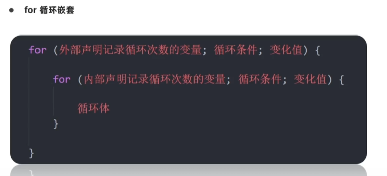

switch...case语句通常处理case为比较确定值的情况，而if...else...语句更加灵活，通常用于范围判断

switch语句进行判断后直接执行到程序的语句，效率更高

如果分支比较少，用if...else语句执行效率高。
当分支比较多时，switch语句执行效率高，而且结构更清晰

### for循环

for循环基本使用
目标：掌握for循环重复执行某些代码

作用：重复执行代码
好处：把声明起始值，循环条件，变化值写到一起，让人一目了然，最常用的循环形式
for (起始值; 终止条件; 变量变化量) {
    // 循环体
}

退出循环 
- continue 退出本次循环
- break 退出整个for循环

while (true) 来构造无限循环，需要使用break退出循环
for (;;) 也可以来构造无限循环，同样需要break退出循环

for循环和while循环有什么区别
- 当明确循环的次数，推荐使用for循环
- 当不明确循环次数的时候推荐使用while循环

### 循环嵌套

1. for循环嵌套
   1. 
   2. 外面的for执行一次，里面的for执行所有次，全部