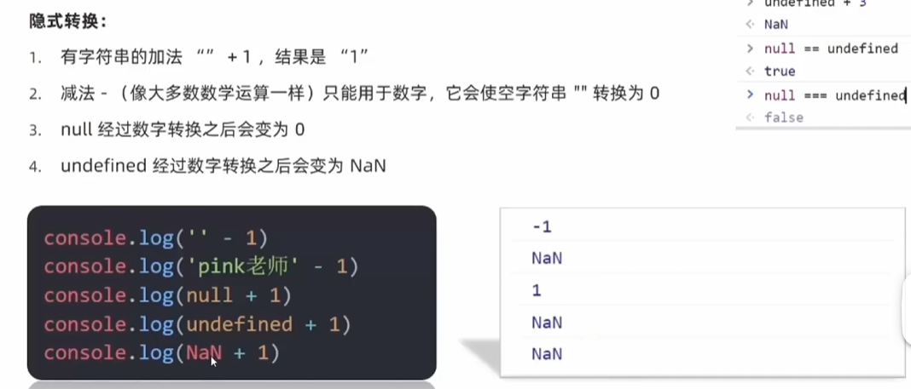

# 函数

### 为什么需要函数

1. 函数：是被设计为执行特定任务的代码块
2. 说明：
   1. 函数可以把具有相同或相似逻辑的代码包裹起来，通过函数调用执行这些被包裹的代码逻辑，这样的优势有利于精简代码方便复用。
   2. 像alert(), prompt()和console.log()都是js函数
3. 函数使用：
   1. 目标：掌握函数语法，把代码封装起来
   2. 函数声明语法：
      1. function 函数名() {函数体}
4. 函数命名规范：
   1. 和变量命名基本一致
   2. 尽量使用小驼峰命名法
   3. 前缀应该为动词
   4. 命名建议：常用动词约定
5. 函数的调用语法：
   1. 函数名()
   2. 声明的函数必须调用才会真正地被执行，使用()调用函数

### 函数传参

若函数完成功能需要调用者传入数据，那么就需要用有参数的函数

function 函数名(参数列表) {函数体}

调用函数时，需要传入几个数据就写几个，用逗号隔开

- 形式参数：声明函数时写在函数名右边小括号里的叫形参 （形式上的参数）
  - 如果一个变量不给值，默认是undefined
  - 用户不输入实参，可以给形参默认值，可以默认为0，显示更严谨
  - 默认值只会在缺少实参参数传递时才会被执行，所以有参数会优先执行传递过来的实参，否则为undefined
- 实际参数：调用函数时写在函数名右边小括号里的叫实参 （实际上的参数）
- 形参可以理解为是在这个函数内声明的变量（比如num1 = 10）实参可以理解为是给这个变量赋值

好处：
- 极大的提高了函数的灵活性

### 函数返回值

把任务的结果给我们
return用处：把处理结果返回给调用者

概念：当调用某个函数，这个函数会返回一个结果出来
这就是有返回这的函数

像pop这类的函数，也有返回值，返回的是删除的函数。

不是所有的函数都有返回值，根据需求来设计到底需不需要返回值。

当函数需要返回数据出去时，用return关键字

语法：return 数据

函数使用return关键字能将内部执行结果交给函数外部使用
return后面代码不会再被执行，会立即结束当前函数，所以return后面的数据不要换行写
return函数可以没有return，这种情况函数默认返回值为undefined

break的结束和return结束有什么区别
break结束的循环或者switch，return结束的是函数

### 函数的定义域

通常来说，一段代码中所用到的名字并不总是有效和可用的，而限定这个名字的可用性的代码范围就是这个名字的作用域

作用域的使用提高了程序逻辑的局部性，增强了程序的可靠性，减少了名字的冲突。

- 全局作用域：全局有效
  - 作用于所有代码执行的环境（整个script标签内部）
- 局部作用域：局部有效
  - 作用于函数内部的代码环境，只能在函数里面使用

### 匿名函数

- 具名函数：function fn() {}
- 匿名函数：function() {}
  - 没有名字的函数，无法直接使用
  - 使用方式：
    - 函数表达式：将匿名函数赋值给一个变量，并且通过变量名称进行调用，我们称这个为函数表达式
    - 立即执行函数
      - 场景介绍：避免全局变量之间的互相污染
      - 不需要额外调用，因为已经调用了
      - 多个立即执行函数之间用分号隔开

### 逻辑中断

1. 逻辑运算符的短路
   1. 短路：只存在于&&（与）和||（或）中，当满足一定条件会让右边代码不执行
   2. 
2. 转换为Boolean型
   1. Boolean（内容）
      1. 
      2. 
  

