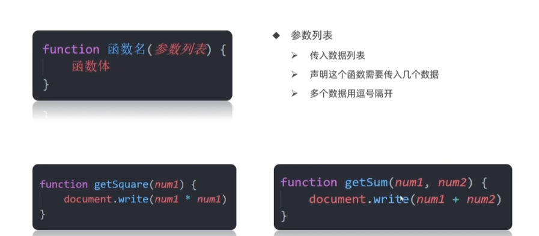

# 函数

### 为什么需要函数

1. 函数：是被设计为执行特定任务的代码块
2. 说明：
   1. 函数可以把具有相同或相似逻辑的代码包裹起来，通过函数调用执行这些被包裹的代码逻辑，这样的优势有利于精简代码方便复用。
   2. 像alert(), prompt()和console.log()都是js函数
3. 函数使用：
   1. 目标：掌握函数语法，把代码封装起来
   2. 函数声明语法：
      1. function 函数名() {函数体}
4. 函数命名规范：
   1. 和变量命名基本一致
   2. 尽量使用小驼峰命名法
   3. 前缀应该为动词
   4. 命名建议：常用动词约定
5. 函数的调用语法：
   1. 函数名()
   2. 声明的函数必须调用才会真正地被执行，使用()调用函数

### 函数传参

若函数完成功能需要调用者传入数据，那么就需要用有参数的函数

function 函数名(参数列表) {函数体}

调用函数时，需要传入几个数据就写几个，用逗号隔开

- 形式参数：声明函数时写在函数名右边小括号里的叫形参 （形式上的参数）
  - 如果一个变量不给值，默认是undefined
  - 用户不输入实参，可以给形参默认值，可以默认为0，显示更严谨
  - 默认值只会在缺少实参参数传递时才会被执行，所以有参数会优先执行传递过来的实参，否则为undefined
- 实际参数：调用函数时写在函数名右边小括号里的叫实参 （实际上的参数）
- 形参可以理解为是在这个函数内声明的变量（比如num1 = 10）实参可以理解为是给这个变量赋值

好处：
- 极大的提高了函数的灵活性