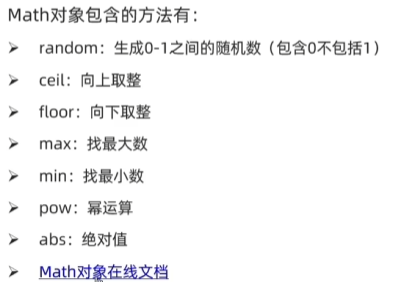
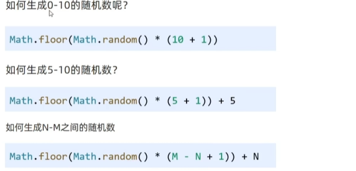
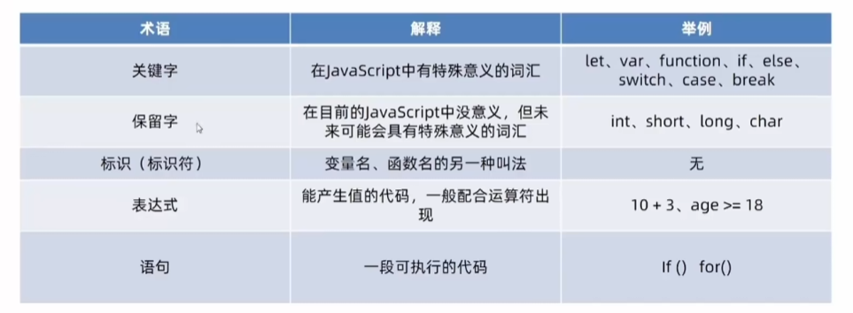
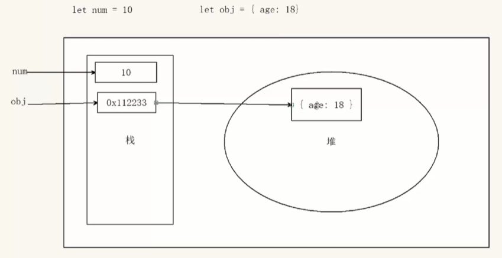
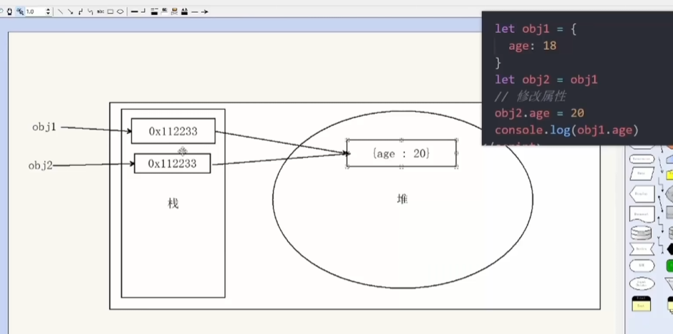

# 对象

1. 对象是什么
   1. 对象(object): JS里的一种数据类型
   2. 可以理解为是一种无序的数据集合，注意数组是有序的数据集合
   3. 用来描述某个事物，例如描述一个人
      1. 人有姓名，年龄，性别等信息
      2. 如果用多个变量保存则比较散，用对象比较统一
         1. let obj = {uname:'pink', age:18, gender:'female'}
      3. 描述信息：
         1. 静态特征，像姓名，年龄，身高，爱好等---可以使用数字，字符串，数组，布尔类型等表示
         2. 动态行为 --- 使用函数表示
2. 对象使用
   1. 目标：掌握对象语法，用它保存多个数据
   2. 对象声明语法
      1. let 对象名 = []
      2. let 对象名 = new Object()
   3. 实际开发中，我们多用大括号，{}是对象字面量
   4. 对象有属性和方法组成
      1. 属性：信息或叫特征(名词)，手机尺寸，颜色
         1. 属性都是成对出现的，包含属性名和值，他们之间使用英文：分隔
         2. 多个属性之间使用逗号，分割
         3. 属性就是依附在对象上的变量（外面是变量，对象内是属性）
         4. 
      2. 方法：功能或叫行为(动词)，手机打电话，发短信
      3. let 对象名 = {属性名：属性值，方法名：函数}
   5. 对象本质是无序的数据集合，操作数据无非就是 增 删 改 查 语法：
      1. 查询对象：对象.属性
         1. 可以使用.获得对象中属性对应的值，称之为属性访问
         2. 语法：对象名.属性
         3. 简单理解就是获得对象里面的属性值
         4. 对于多次属性或-等属性，点操作就不能用了。
         5. 我们可以采取：对象['属性']方式，单引号和双引号都可以
      2. 属性：改
         1. 语法：对象名.属性 = 新值
      3. 属性：增
         1. 语法：对象名.新属性 = 新值
      4. 属性：删
         1. 语法：delete 对象名.属性
   6. 对象中的方法
      1. 数据行为性的信息称为方法，如跑步，唱歌等，一般是动词性，其本质是函数
      2. 声明对象，并添加了若干方法后，可以使用，调用对象中的函数，我称之为方法调用
      3. 也可也添加形参或实参
      4. 注意：千万别忘了给方法名后面加小括号
3. 遍历对象
   1. 目标：能够遍历输出对象里面的元素
   2. 遍历对象：
      1. 对象是无序的，没有规律，不像数组里面有规律的下标
      2. for遍历对象的问题：因为无序
      3. 语法 for (let k in obj) {}
      4. 一定记得：k是获得对象的属性名，对象名[k]是获得属性值
4. 内置对象
   1. 内置对象是什么？
      1. JS内部提供的对象，包含各种属性和方法给开发者调用，已经内置好了，不用自己在进行编写
      2. 思考：我们之前用过内置对象吗
         1. document.write()
         2. console.log()  对象.方法()
   2. 内置Math对象
      1. 介绍：Math对象是JS提供的一个数学对象
      2. 作用：提供了一系列做数学运算的方法
      3. 
   3. 内置对象 - 生产任意范围随机数
      1. Math.random() 随机数函数，返回一个0 - 1之间，并且包括0不包括1的随机小数 [0,1)
      2. 
5. 关键字
   1. 
   2. 变量不能是关键字，保留字等
6. 基本数据类型和引用数据类型
   1. 简单类型又叫做基本数据类型或者值类型，复杂类型又叫做引用类型
      1. 值类型：简单数据类型，在存储时变量中存储的是值的本身，因此叫做值类型
         1. str,number,boolean
      2. 引用类型：复杂数据类型，在存储时变量中存储的仅仅是地址(引用)，因此叫做引用数据类型
         1. 通过new关键字创造对象，如obj,array,date等
   2. 堆栈空间分配：
      1. 栈（操作系统）：由操作系统自动分配释放存放函数的参数值，局部变量的值等，其操作类似于数据结构中的栈
         1. 简单数据类型存放到栈里
         2. 存放的是值，然后通过variable找到值
      2. 堆（操作系统）：存储复杂类型（对象），一般由程序员分配释放，若程序员不释放，由垃圾回收机制回收
         1. 引用数据类型存放到堆里
         2. obj对象在栈里存的是地址，一串16进制数，通过obj的名字找到地址，然后通过栈里面的地址找到堆里里面的对象
      3. 
      4. 